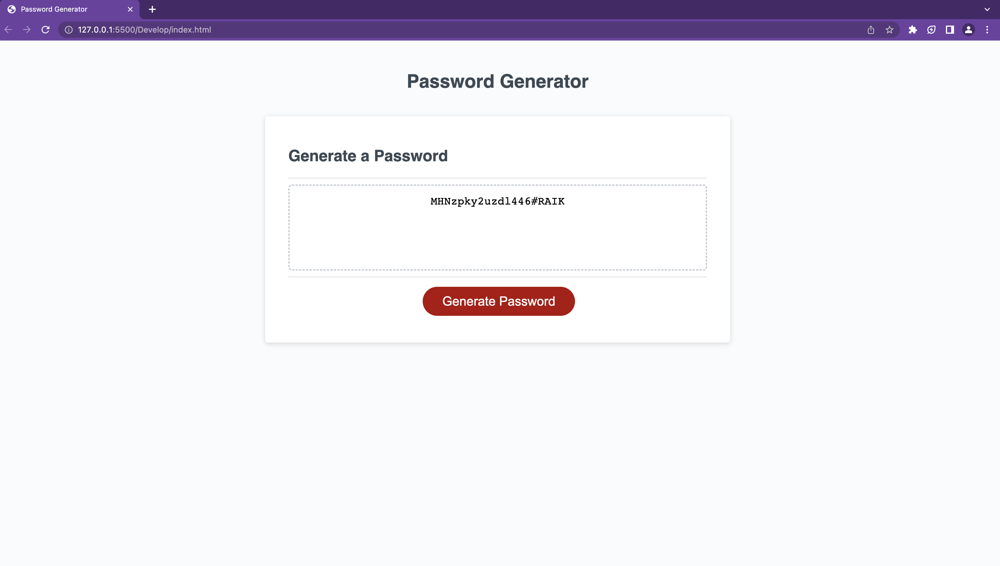

# Password-generator
## Description

This app showcases on how javascript is used to generate a password.

## Technology Used

In this app, the technology that i have used to show prompts and generating a 
password is JavaScript.
JavaScript is used to create the fuctions so the app can display the password 
being generated.

## Summary
Here is how the password is generated:
* Created variables for numbers, symbols, and letters
* To change the letters to uppercase i created a fuction and applied it to a variable named: upper.
* created a function that generates the password
* Within the generatePassword function, I used a for loop to generate ramdom passwords with the created
variables that hold the numbers symbols and letters
* Within the generatePassword function, I used a if and else if statements to generate a series of prompts with each one having a criteria to choose.
* By combining all the code created, the app is able to generate a passwrod and show prompts. 

## Author Link
https://github.com/jdiego-17 